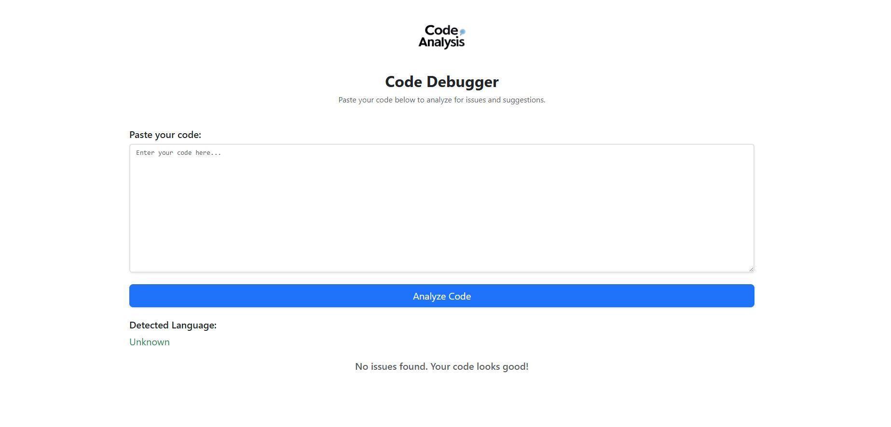
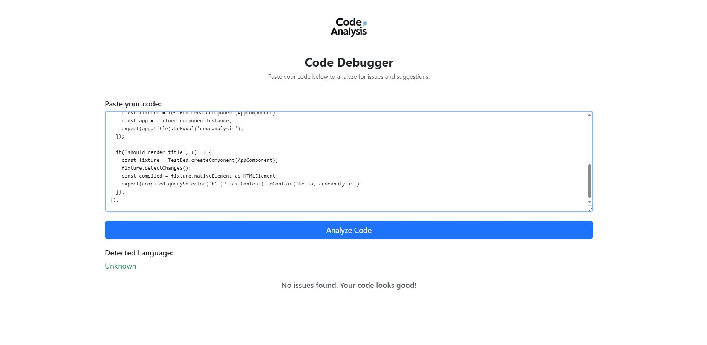
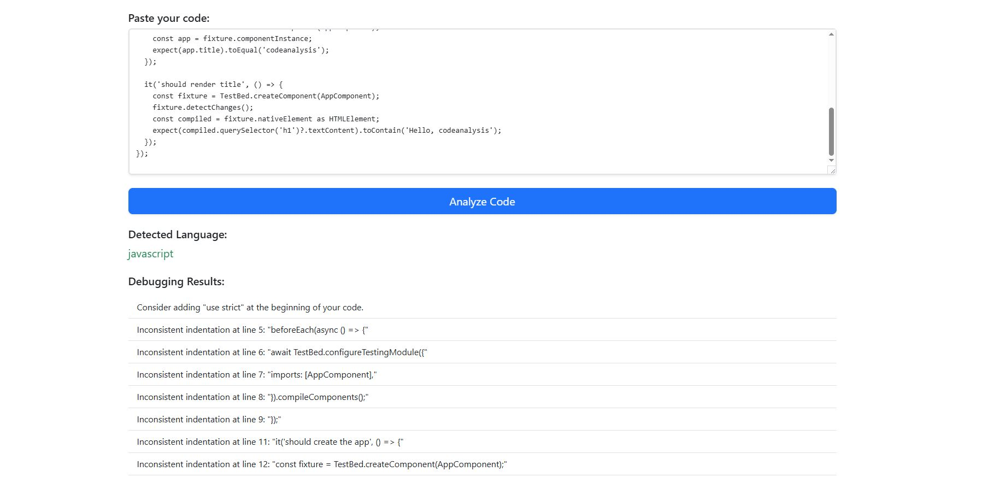

# Codeanalysis

This project was generated using [Angular CLI](https://github.com/angular/angular-cli) version 19.1.6.

# Code Debugger

## Overview

**Code Debugger** is an interactive web-based tool that allows users to paste their source code, analyze it for common issues and suggestions, and get a detailed report on the possible improvements. It supports various programming languages such as JavaScript, Python, C++, TypeScript, Java, PHP, and more.

### Features:
- **Code Analysis**: Paste your code into the input box, and the tool will analyze it for issues based on the selected language.
- **Real-time Feedback**: Provides instant feedback and suggestions for common coding practices.
- **Multi-language Support**: Supports multiple programming languages, including JavaScript, Python, C++, and others.
- **User-Friendly Interface**: A clean and simple user interface with a responsive layout.

## Screenshots

## Technologies Used

- **Angular**: Frontend framework for building the user interface.
- **Bootstrap**: For responsive design and styling.
- **TypeScript**: Programming language for building the app logic.
- **ngModel**: For two-way data binding with the textarea input.

## Getting Started

### Prerequisites

Make sure you have the following installed on your machine:
- **Node.js** (v14 or above)
- **Angular CLI** (installed globally)

### Installing

1. Clone this repository:

git clone https://github.com/your-username/code-debugger.git
Navigate to the project directory:
bash
Copy
Edit
cd code-debugger
Install the dependencies:
bash
Copy
Edit
npm install
Serve the app locally:
bash
Copy
Edit
ng serve
After that, open your browser and navigate to http://localhost:4200 to view the application.

Usage
Paste your code into the "Paste your code" section.
Click the "Analyze Code" button to start the analysis.
The detected language and any potential issues with your code will be displayed below.
Supported Languages
JavaScript
Python
C++
TypeScript
Java
PHP
C#
Go
Contributing
We welcome contributions to improve the tool. Feel free to open an issue or submit a pull request.

Steps to Contribute:
Fork the repository.
Create a new branch (git checkout -b feature-name).
Make your changes and commit them (git commit -am 'Add new feature').
Push your branch to your forked repository (git push origin feature-name).
Open a pull request to the main repository.
License
This project is licensed under the MIT License - see the LICENSE file for details.

markdown
Copy
Edit

### **What’s Included:**

- **Logo**: At the top of the README using ``. Make sure to place your logo image in the `assets` folder.
- **Overview Section**: Describes the functionality of the app.
- **Technologies Used**: Lists the technologies used to build the app.
- **Installation Instructions**: Detailed instructions on how to install and run the app locally.
- **Usage Instructions**: Simple steps on how to use the app after installation.
- **Supported Languages**: Lists the programming languages supported by the app.
- **Contributing Section**: Describes how users can contribute to the project.
- **License Section**: Includes the project license (e.g., MIT License).
